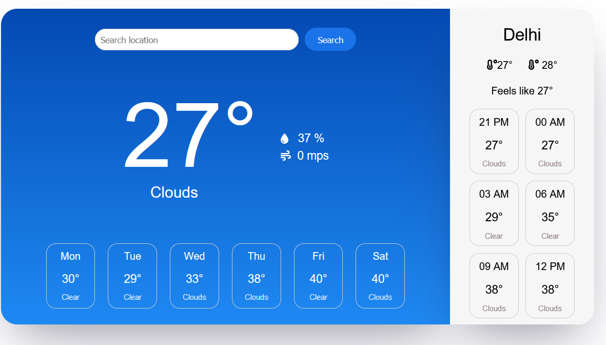

# Weather Dashboard

The Weather Dashboard is a web application that displays weather information for a given city. It provides both daily and hourly weather forecasts, allowing users to quickly and easily check weather conditions. The app fetches weather data from a weather API and displays it in a user-friendly format.

Features

- Location Selection: Choose a city to fetch its weather data.
- Daily Forecast: View the daily weather forecast, including temperature, humidity, wind speed, and general weather conditions.
- Hourly Forecast: Get an hourly breakdown of the temperature and weather conditions for the selected city.
- External Links: Easily link to additional information about the selected city.

Prerequisites

- node version (18.x.x)
- npm package

Installation

- Clone Project
- Install npm package
- Create a .env file in your local setup
- Copy code from .env.sample file - add your OPENWEATHER API key in .env file
- Run project using `npm run dev` in your terminal
